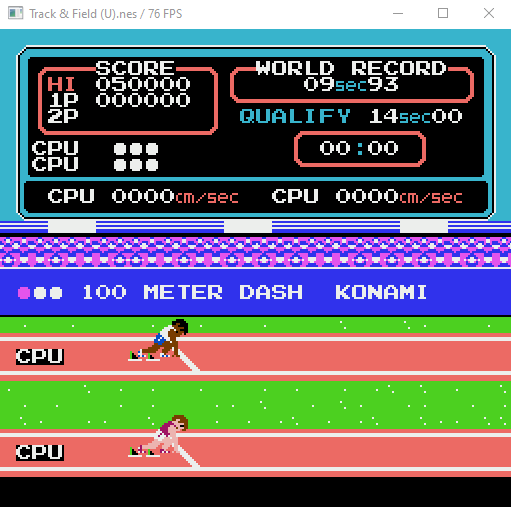
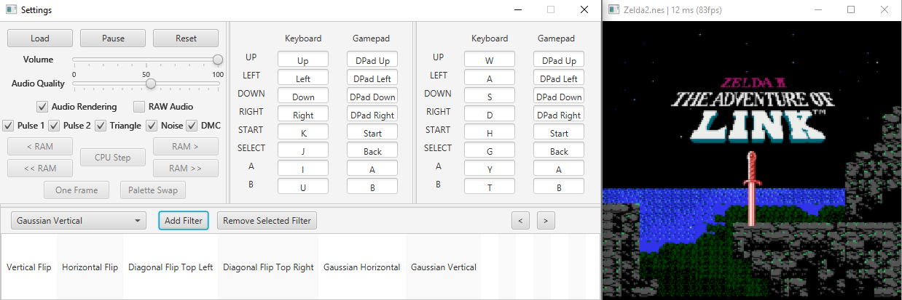

# NEmuS

> An experimental NES Emulator written in Java


---

## Table of Contents

- [Features](#features)
- [Screenshots](#screenshots)
- [Libraries](#libraries)
- [Thanks](#thanks)
- [License](#license)

---

## Features
### Core
* 6502 CPU Emulation with basic decompiler
* 2C02 PPU Emulation
* 2A03 APU Emulation with 2 Pulse Channels, a Triangle Channel, a Noise Channel and a DMC (or PCM) Channel
* Emulation of saves for games supporting it (every 30s)
* iNES Mappers (Non-exhaustive Game list):
  - [NROM](https://wiki.nesdev.com/w/index.php/INES_Mapper_000) (000) : Super Mario Bros, Donkey Kong, Duck Hunt, Ice Climbers, Excitebike 
  - [MMC1](https://wiki.nesdev.com/w/index.php/INES_Mapper_001) (001) : Legend of Zelda, Zelda 2, Metroid, Mega Man 2, 
  - [UxROM](https://wiki.nesdev.com/w/index.php/INES_Mapper_002) (002) : Castlevania, DuckTales, Mega Man, Metal Gear
  - [CNROM](https://wiki.nesdev.com/w/index.php/INES_Mapper_003) (003) : Track & Field
  - [MMC3](https://wiki.nesdev.com/w/index.php/INES_Mapper_004) (004) : Super Mario Bros 2, Super Mario Bros 3
  - [GxROM](https://wiki.nesdev.com/w/index.php/INES_Mapper_066) (066) : Super Mario Bros + Duck Hunt, Dragon Ball
### Controls
* Mappable controls (via the Settings window)
* Gamepads and Joystick support
### User Interface
* Post Processing Pipeline editable at runtime (Powered by OpenGL)
* Settings window
  - Load ROM
  - Pause/Resume emulation
  - Reset
  - Advance by a Frame (when emulation is paused)
  - Add/Remove/Move Post Processing Filter from the pipeline
  - Change Volume
  - Change Audio Quality (Big impact on performance)
  - Disable Audio Rendering (Big impact on performance)
  - Enable/Disable specific Audio Channels
  - Edit the controllers input mapping in real-time
  - (DEBUG MODE) Advance by a CPU Instruction (Assembly step)
  - (DEBUG MODE) Switch the Palette used by the Pattern Table Viewer
  - (DEBUG MODE) Change the current RAM Page (± 0x1 or ± 0x10)
* A Debug window showing the following information :
  - The state of the CPU (Registers, Stack Pointer and Program Counter)
  - One page of RAM (as seen by the CPU) navigable
  - The disassembled code being executed
  - Object Attribute Memory
  - Palettes, Pattern Tables and Nametables (with mirroring)

## How to Use
- To launch the Emulator in Debug Mode simply set the DEBUG_MODE attribute to true in the ```NEmuS.java``` file

## Screenshots






## Libraries
- **[LWJGL 3](https://www.lwjgl.org/)** Used to handle Rendering 
- **[JavaFX](https://openjfx.io/)** For simple user interactions 
- **[Beads](http://www.beadsproject.net/)** Used to handle Audio

## Thanks
- **[OneLoneCoder](https://www.youtube.com/channel/UC-yuWVUplUJZvieEligKBkA)** [(Github)](https://github.com/OneLoneCoder) For his amazing video series about the NES and its inner workings
- **[NESDev Wiki](https://wiki.nesdev.com/w/index.php/Nesdev_Wiki)** For making available all of this information about the system in one place

## License

This project is licensed under the **[MIT license](http://opensource.org/licenses/mit-license.php)**
