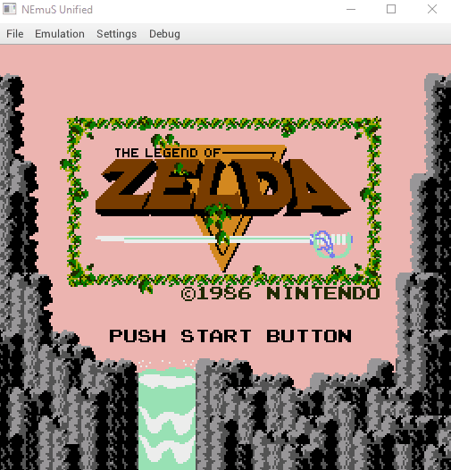
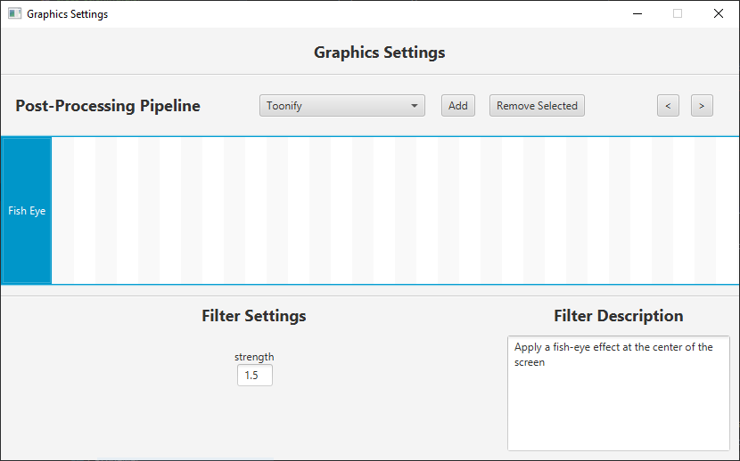

# NEmuS

> An experimental NES Emulator written in Java




---

## Table of Contents

- [Features](#features)
- [Screenshots](#screenshots)
- [Libraries](#libraries)
- [Thanks](#thanks)
- [License](#license)

---

## Features
### Core
* 6502 CPU Emulation with basic decompiler
* 2C02 PPU Emulation
* 2A03 APU Emulation with 2 Pulse Channels, a Triangle Channel, a Noise Channel and a DMC (or PCM) Channel
* Emulation of saves for games supporting it (every 30s)
* iNES Mappers (Non-exhaustive Game list):
  - [NROM](https://wiki.nesdev.com/w/index.php/INES_Mapper_000) (000) : Super Mario Bros, Donkey Kong, Duck Hunt, Ice Climbers, Excitebike 
  - [MMC1](https://wiki.nesdev.com/w/index.php/INES_Mapper_001) (001) : Legend of Zelda, Zelda 2, Metroid, Mega Man 2, 
  - [UxROM](https://wiki.nesdev.com/w/index.php/INES_Mapper_002) (002) : Castlevania, DuckTales, Mega Man, Metal Gear
  - [CNROM](https://wiki.nesdev.com/w/index.php/INES_Mapper_003) (003) : Track & Field
  - [MMC3](https://wiki.nesdev.com/w/index.php/INES_Mapper_004) (004) : Super Mario Bros 2, Super Mario Bros 3
  - [MMC2](https://wiki.nesdev.com/w/index.php/INES_Mapper_009) (009) : Mike Tyson's Punch Out!! (Glass Joe fight not starting, but others do ??)
  - [GxROM](https://wiki.nesdev.com/w/index.php/INES_Mapper_066) (066) : Super Mario Bros + Duck Hunt, Dragon Ball
### Controls
* Fully customizable controllers inputs
* Gamepads and Joystick support
### User Interface
* Main Game Window allowing you to :
  - Load a ROM
  - Pause / Resume emulation
  - Reset the emulator
* Audio Settings Window allowing you to :
  - Set the volume
  - Set the audio quality
  - Enable / Disable audio rendering
  - Switch to RAW audio
  - Enable / Disable specific audio channels
* Graphics Settings Window allowing you to :
  - Add / Remove filters
  - Rearrange filters order
* Controller Settings Window allowing you to customize controls scheme
* CPU Viewer Window allowing you to :
  - See current CPU Status (Registers, Program Counter, Stack Pointer)
  - See currently executed assembly code
  - See the entire addressable range of the CPU in realtime
  - Step through the code line by line or frame by frame
* PPU Viewer Window allowing you to :
  - See the palettes
  - See the pattern tables and apply a palette to them
  - See the nametables
  - See the OAM Memory (as a list and rendered)
* APU Viewer Window showing you the waveform of each channel and the mixer in realtime

## How to Use
### Launch
To launch the Emulator set the Main Class to ```NEmuSUnified.java```
### Add custom Filters
To add a new Filter the following steps are needed :
* Write the shaders
  - Write the vertex shader or reuse the default one : ```shaders/vertex.glsl```
      ```glsl
        //Example vertex shaders
        //this shader will flip the UVs
        #version 330
        
        layout(location = 0) in vec2 position;  //the vertex coords
        
        out vec2 pass_textureCoords;            //the UVs that are passed to the fragment
        
        void main() {
         pass_textureCoords = position * 0.5 + 0.5;           //the UVs are calculated from the vertex coords
         gl_Position = vec4(position.x, -position.y, 0, 1.0); //the position is set but the Y coords is flipped
        }
      ```
  - Write the fragment shader 
      ```glsl
        //Example fragment shaders
        //this shader will replace color that are brighter than a threshold with black
        #version 330
        
        in vec2 pass_textureCoords; //UVs
        out vec4 fragColor;         //pixel color
        
        uniform sampler2D tex;      //sampled texture (Name is important)
        uniform float threshold;    //uniform variable
        
        void main() {
          vec3 color = texture2D(tex, pass_textureCoords).rgb; //sample the texture at the passed UVs coords
          if (0.3 * color.r + 0.59 * color.g + 0.11 * color.b > threshold)
              color = vec3(0);
          fragColor = vec4(color, 1.0);
        }
      ```
  - When your shaders are ready you can register the filter in ```Filter.java``` as follows
      ```java
        public enum Filter {
            ...
            //If uniforms are declared either in the vertex or fragment shader, you need to add them with the same exact name, and a default value (you can add as many as you want)
            EXAMPLE_FILTER("My Filter name", "shader/myVertex.glsl", "shader/myFragment.glsl", "My Filter description", new UniformFloat("threshold", 1f));
            ...
        }   
      ```
  - That's it, your Filter will appear in the Graphics Settings along with a section that will let you edit the uniforms to tweak the filter at runtime

## Screenshots




## Libraries
- **[LWJGL 3](https://www.lwjgl.org/)** Used to handle Rendering 
- **[LWJGUI](https://github.com/orange451/LWJGUI)** Used for the Main window
- **[JavaFX](https://openjfx.io/)** For all other windows
- **[Beads](http://www.beadsproject.net/)** Used to handle Audio

## Thanks
- **[OneLoneCoder](https://www.youtube.com/channel/UC-yuWVUplUJZvieEligKBkA)** [(Github)](https://github.com/OneLoneCoder) For his amazing video series about the NES and its inner workings
- **[NESDev Wiki](https://wiki.nesdev.com/w/index.php/Nesdev_Wiki)** For making available all of this information about the system in one place

## License

This project is licensed under the **[MIT license](http://opensource.org/licenses/mit-license.php)**
