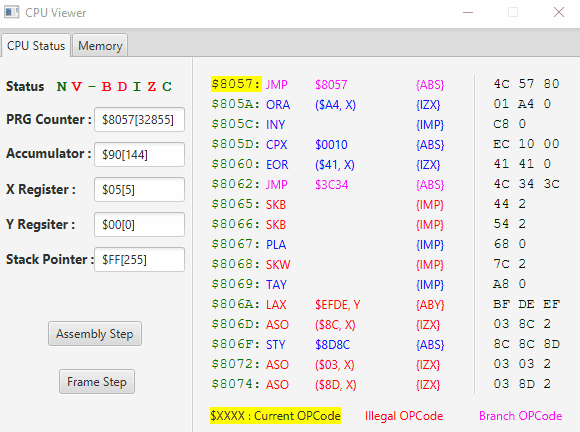
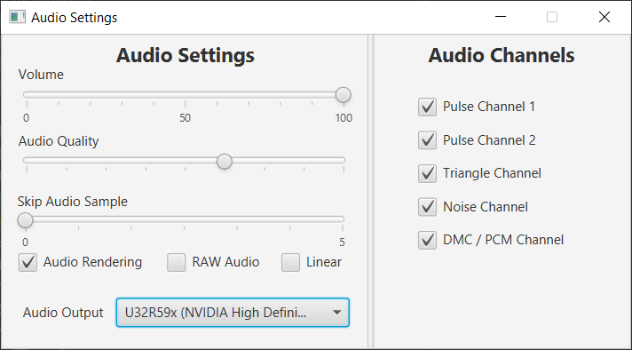

# NEmuS

> An experimental NES Emulator written in Java


---

## Table of Contents

- [Features](#features)
- [Screenshots](#screenshots)
- [Libraries](#libraries)
- [Thanks](#thanks)
- [License](#license)

---

## Features
### Core
* 6502 CPU Emulation with basic decompiler
* 2C02 PPU Emulation
* 2A03 APU Emulation with 2 Pulse Channels, a Triangle Channel, a Noise Channel and a DMC (or PCM) Channel
* Emulation of saves for games supporting it (every 30s)
* iNES Mappers (Non-exhaustive Game list):
  - [NROM](https://wiki.nesdev.com/w/index.php/INES_Mapper_000) (000) : Super Mario Bros, Donkey Kong, Duck Hunt, Ice Climbers, Excitebike 
  - [MMC1](https://wiki.nesdev.com/w/index.php/INES_Mapper_001) (001) : Legend of Zelda, Zelda 2, Metroid, Mega Man 2, 
  - [UxROM](https://wiki.nesdev.com/w/index.php/INES_Mapper_002) (002) : Castlevania, DuckTales, Mega Man, Metal Gear
  - [CNROM](https://wiki.nesdev.com/w/index.php/INES_Mapper_003) (003) : Track & Field
  - [MMC3](https://wiki.nesdev.com/w/index.php/INES_Mapper_004) (004) : Super Mario Bros 2, Super Mario Bros 3
  - [GxROM](https://wiki.nesdev.com/w/index.php/INES_Mapper_066) (066) : Super Mario Bros + Duck Hunt, Dragon Ball
### Controls
* Fully customizable controllers inputs
* Gamepads and Joystick support
### User Interface
* Main Game Window allowing you to :
  - Load a ROM
  - Pause / Resume emulation
  - Reset the emulator
* Audio Settings Window allowing you to :
  - Set the volume
  - Set the audio quality
  - Enable / Disable audio rendering
  - Switch to RAW audio
  - Enable / Disable specific audio channels
* Graphics Settings Window allowing you to :
  - Add / Remove filters
  - Rearrange filters order
* Controller Settings Window allowing you to customize controls scheme
* CPU Viewer Window allowing you to :
  - See current CPU Status (Registers, Program Counter, Stack Pointer)
  - See currently executed assembly code
  - See the entire addressable range of the CPU in realtime
  - Step through the code line by line or frame by frame
* PPU Viewer Window allowing you to :
  - See the palettes
  - See the pattern tables and apply a palette to them
  - See the nametables
  - See the OAM Memory (as a list and rendered)
* APU Viewer Window showing you the waveform of each channel and the mixer in realtime

## How to Use
- To launch the Emulator in Debug Mode simply set the DEBUG_MODE attribute to true in the ```NEmuS.java``` file

## Screenshots





## Libraries
- **[LWJGL 3](https://www.lwjgl.org/)** Used to handle Rendering 
- **[LWJGUI](https://github.com/orange451/LWJGUI)** Used for the Main window
- **[JavaFX](https://openjfx.io/)** For all other windows
- **[Beads](http://www.beadsproject.net/)** Used to handle Audio

## Thanks
- **[OneLoneCoder](https://www.youtube.com/channel/UC-yuWVUplUJZvieEligKBkA)** [(Github)](https://github.com/OneLoneCoder) For his amazing video series about the NES and its inner workings
- **[NESDev Wiki](https://wiki.nesdev.com/w/index.php/Nesdev_Wiki)** For making available all of this information about the system in one place

## License

This project is licensed under the **[MIT license](http://opensource.org/licenses/mit-license.php)**
